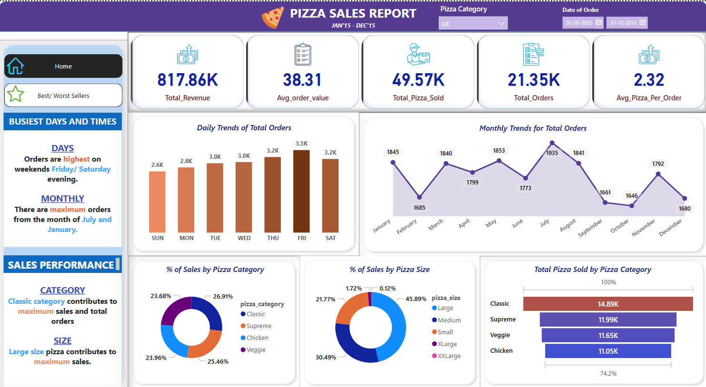
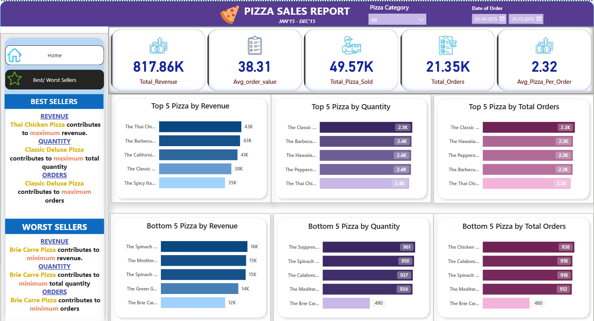

# 🍕 Pizza Sales Analysis  
**Data Analysis & Visualization using SQL & Power BI**  

## 📌 Overview  
This project explores **pizza sales data** to uncover key insights on revenue, sales trends, and best-selling pizzas using **SQL queries** and a **Power BI dashboard**.

## 📊 Key Metrics  
- **Total Revenue:** $817.86K  
- **Avg Order Value:** $38.31  
- **Total Pizzas Sold:** 49.57K  
- **Total Orders:** 21.35K  
- **Avg Pizzas Per Order:** 2.32  

## 🔍 Analysis Performed  
### **1️⃣ SQL Analysis**  
✔ **Revenue & Orders:**  
   - Total revenue, avg order value, and total orders.  
✔ **Sales Trends:**  
   - Orders by weekday/month.  
✔ **Category & Size Analysis:**  
   - % sales by category & size.  
✔ **Top/Bottom Performing Pizzas:**  
   - Based on revenue, quantity sold, and orders.  

### **2️⃣ Power BI Dashboard**  
✔ Interactive visuals for:  
   - Daily & Monthly Trends 📈  
   - Best/Worst Selling Pizzas 🍕  
   - Sales by Category & Size 📊  

## 🚀 How to Use  
1️⃣ **Run SQL Queries:** (See `SQL_Exploration.sql/` folder or `Pizza_Orders_Queries_With_SS.pdf` with results)  
2️⃣ **Explore Power BI Dashboard:** Open `PizzaSalesReport.pbix`  

## 📸 Sample Visuals  
  
  

## 📂 Files & Resources  
- **SQL Queries** (`SQL_Exploration.sql`) – SQL scripts for analysis.  
- **Power BI Report** (`PizzaSalesReport.pbix`) – Interactive dashboard.  
- **Visuals** (`PizzaSalesReport.pdf`) – Screenshots from Power BI.  

## 👩‍💻 Connect with me  
**Shrine Mary Reji**  
📧 [maryshrine18@gmail.com] | 🔗 [LinkedIn Profile](https://www.linkedin.com/in/shrinemary-analyst/)

---

